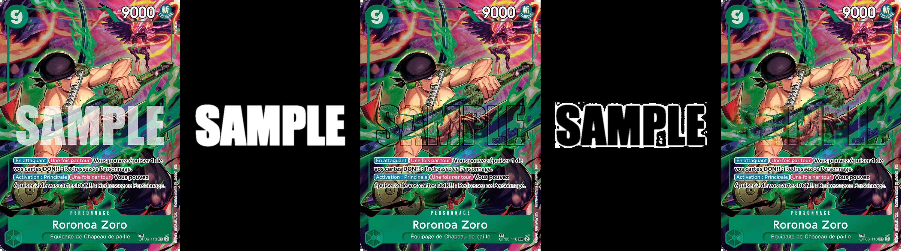

# TCGScanner

An open-source desktop app to scan physical trading cards with a webcam, identify them using a machine learning model, and export your collection to CSV for import on sites like [riftbound.gg](https://riftbound.gg).

Built with [Wails](https://wails.io/) (Go + React/TypeScript) into a single native binary.

## Features

- **Live camera scanning** — point your webcam at a card and get a real-time prediction
- **ML-powered identification** — uses a TensorFlow Lite classification model (MobileNetV2, EfficientNet-B0/B3)
- **Auto-lock** — automatically locks on a card when confidence reaches 99%
- **Foil / Normal toggle** — track card finish before saving
- **Collection management** — organize scans into collections, switch between them anytime
- **CSV export** — export any collection to CSV for import sites
- **Multi-model support** — drop any compatible model into `./models/` and select it at runtime
- **Multi-camera support** — choose between connected cameras

## Requirements

- [Go 1.21+](https://go.dev/)
- [Node.js 18+](https://nodejs.org/)
- [Wails CLI v2](https://wails.io/docs/gettingstarted/installation) — `go install github.com/wailsapp/wails/v2/cmd/wails@latest`
- A TFLite model + labels (see [Adding a model](#adding-a-pre-built-model))

The TFLite shared library is embedded in the binary — no C compiler or environment variables required.

## Getting Started

### Build & run

```bash
# Install frontend dependencies
cd frontend && npm install && cd ..

# Live development (hot reload)
wails dev

# Build a production binary
wails build
```

## Pre-built Models

Pre-built models for **Riftbound** and **One Piece** are available here:
[Google Drive — Pre-built models](https://drive.google.com/drive/folders/1hEbXABvjob_O-DmMwDbtjYJrJ61U-QV1?usp=sharing)

Download and place them under `./models/` following the structure in [Adding a Pre-built Model](#adding-a-pre-built-model).

## Training a Model

The `scripts/` folder contains two Python scripts to build a model from scratch.

### Requirements

```bash
pip install albumentations opencv-python-headless numpy tqdm tensorflow
```

### 1. Prepare card images

Place one PNG per card in `scripts/images/<name>/`, named with the card ID:

```
scripts/images/riftbound/
    ogn-001-298.png
    ogn-002-298.png
    ...
```

### 2. Augment

Generates ~50 variations per card composited onto random backgrounds:

```bash
cd scripts
python augment.py --input images/riftbound
# with a specific backbone (sets output image size):
python augment.py --input images/riftbound --backbone efficientnet-b3
# with custom count and real background photos:
python augment.py --input images/riftbound --per-card 100 --backgrounds backgrounds/
```

Output: `scripts/datasets/riftbound/` — one subfolder per card ID.

### 3. Train

Trains a classifier and exports to TFLite. Three backbones are supported:

| Backbone | Input size | Notes |
|---|---|---|
| `mobilenetv2` | 224×224 | Default, fast |
| `efficientnet-b0` | 224×224 | Better accuracy |
| `efficientnet-b3` | 300×300 | Best accuracy, larger model |

```bash
python train.py --name riftbound
# with a specific backbone:
python train.py --name riftbound --backbone efficientnet-b3
# with more epochs:
python train.py --name riftbound --backbone efficientnet-b0 --epochs 30
```

Output in `scripts/models/riftbound/`:
- `model.tflite` — quantized model for the app
- `labels.json` — class index → card ID mapping
- `model.keras` — full model for retraining
- `config.json` — backbone and image size metadata (read by the app at runtime)

### 4. Deploy

Copy the output to the app's models folder:

```bash
cp -r scripts/models/riftbound models/riftbound
```

Then launch the app and select `riftbound` from the model dropdown.

## Adding a Pre-built Model

If you already have a compatible TFLite model:

1. Create a folder under `./models/<name>/`
2. Place your `model.tflite` and `labels.json` inside
3. Add card images to `./models/<name>/images/` named `{card_id}.png` (or `.jpg`/`.webp`)
4. Launch the app and select your model from the dropdown

`labels.json` format:
```json
{ "0": "ogn-001-298", "1": "ogn-002-298", ... }
```

## Removing Watermarks from Card Images

Some TCG publishers (e.g. One Piece) add a **SAMPLE** watermark to their official card scans. `scripts/unwater_op.py` removes it automatically before augmentation.

The technique works by averaging many cards together — card art cancels out while the fixed watermark remains, producing a reusable mask. A two-pass removal then strips the white text (math inversion) and the dark outline (inpainting).


*Left to right: original · white mask · white text removed · dark outline mask · final result*

### Usage

```bash
cd scripts
pip install opencv-python-headless numpy tqdm

# Step 1 — generate the mask from your card images (averages ~20 cards)
python unwater_op.py mask --input images/onepiece/

# Step 2 — remove the watermark from all cards
python unwater_op.py remove --input images/onepiece/ --output images/onepiece-clean/ --mask sample_mask.png

# Step 3 (optional) — preview a single card and save a comparison image
python unwater_op.py preview --input images/onepiece/OP01-001.webp --mask sample_mask.png
```

The `--strength` parameter (default `0.7`) controls how aggressively the white text is removed — increase it if the watermark is still visible, decrease it if the card art is being affected.

### Adapting for other card types

The script can be reused for any card set with a fixed watermark:

1. Adjust the `center_mask` crop region in `generate_mask()` (`y1/y2/x1/x2` as fractions of card height/width) to match where the watermark sits on your cards
2. Tune the brightness threshold (`160`) and `--strength` for the watermark opacity
3. Run `mask` → `preview` → adjust → `remove`

## CSV Export Format

| Normal Count | Foil Count | Card ID |
|--------------|------------|---------|
| 1 | 0 | ogn-001-298 |

## License

MIT
